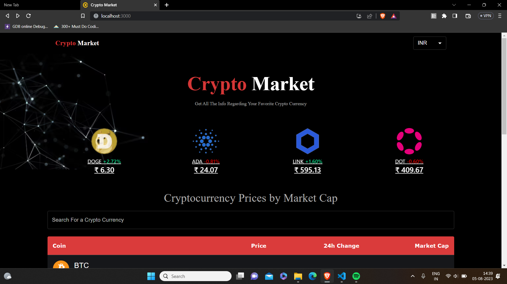
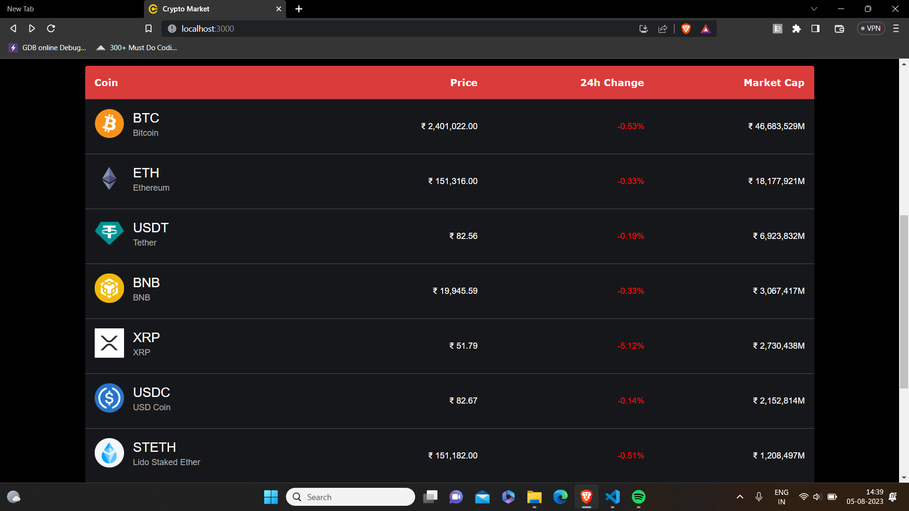
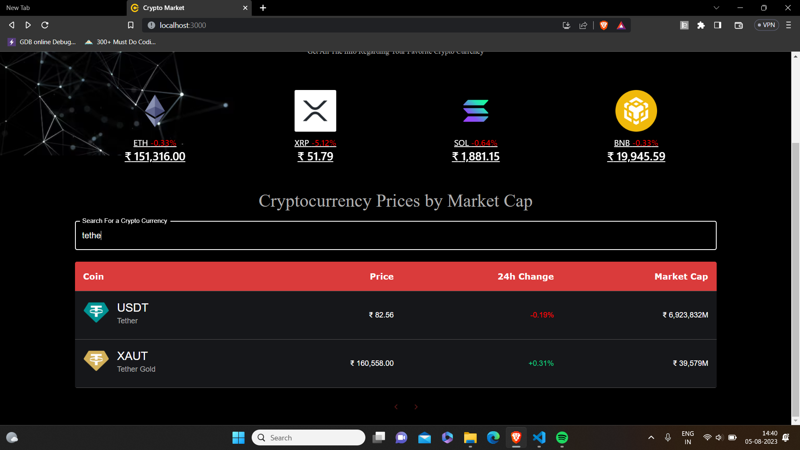
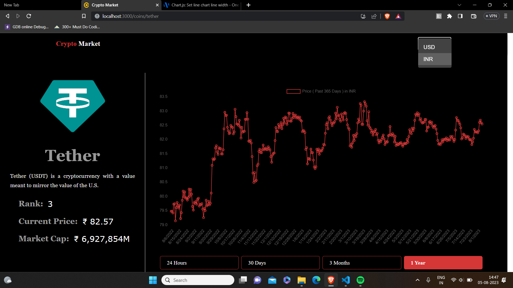
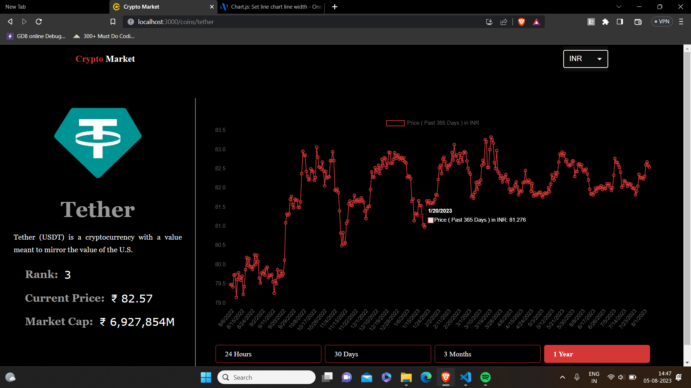

# CRYPTO MARKET

## Introduction:
- Crypto Market is a RealTime Crypto Tracker App 

- Users can can see the current price, the net Market Cap, profit and losses of the cryptocurrencies 

- Users can also see the data and the graph of past 24h, past 1 month, past 3 months and past 1 year

- CoinGecko API is used for the Realtime Crypto Data

## Technology:
- ReactJS

- CoinGecko API for Realtime data

- React Line Chart for the graphical representation of data

- React Linear and Circular Progression as Loader

- MaterialUI for design
  
## In the Home Page users can see a carousal with name, price, symbol and profit/loss of the coins

## Users can view the Table with coins name and 24h change with pagination at the bottom, with only 10 coins per page

## Users can also search for the coins they want

## Users can see the Graphical representation of ups/downs of market in past 24h, 1month, 3months, 1year. They can view the rank of the coins(based on Market Cap), the coins description and the net Market value of the coins. Users can view the prices in INR and USD

## By pointing on the graph of particular date, user can view the price of coins on that particular date

## To start with the application:
- Initially clone or download the zip of the project

- Install the required node modules using "npm i"

- Use "npm start" to run the project and project will start at localhost:3000

 

